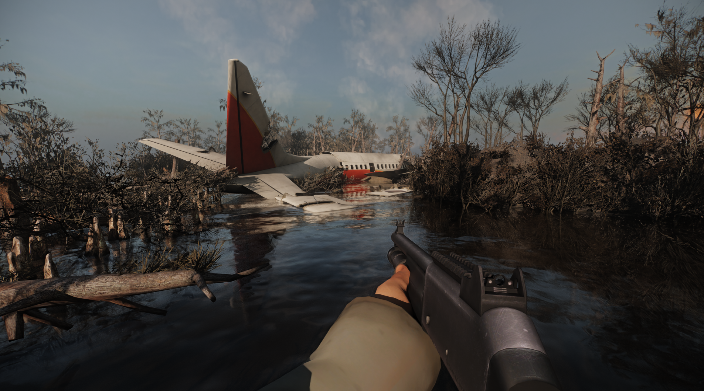
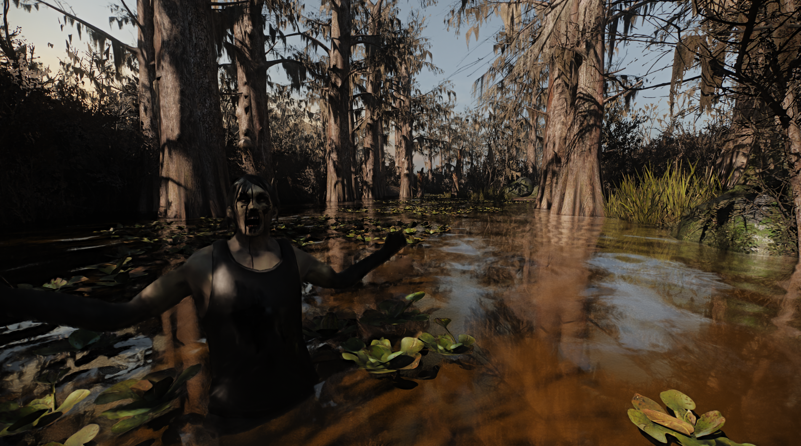
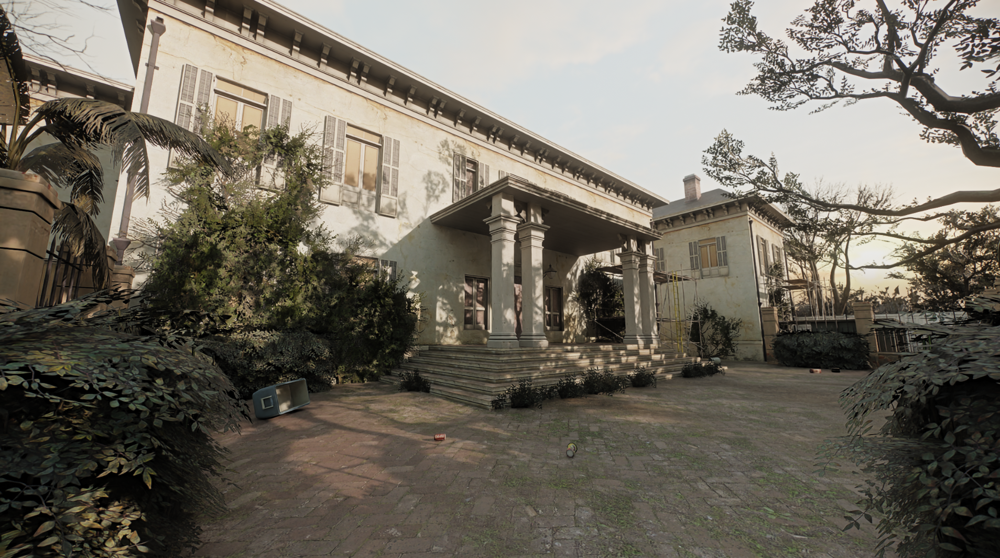
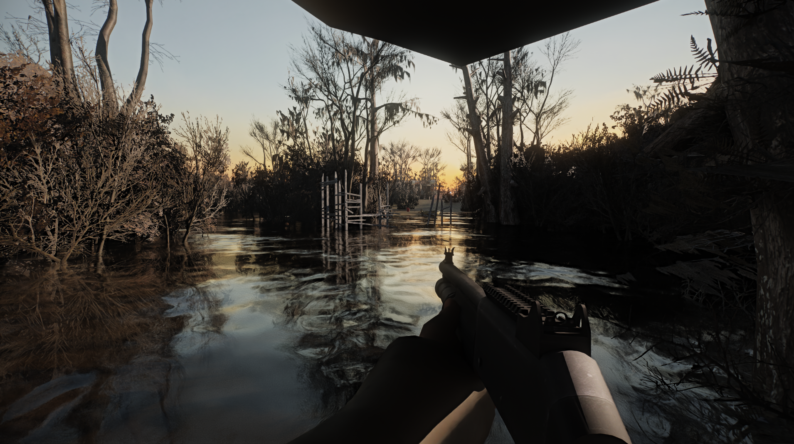

<h1 align="center">Left 4 Dead 2 - RTX Remix Compatibility Mod</h1>

 

This client modification is specifically made for nvidia's [rtx-remix](https://github.com/NVIDIAGameWorks/rtx-remix).  
How does a shader based game work with remix? By manually reimplementing fixed function rendering :) 

 

__WIP__ & __Please Note:__  
RTX Remix was never intented to support this game so expect stuff to be broken.  
__This is not trying to be a remaster__. It simply makes the game compatible with RTX Remix.

Please keep that in mind.

 

 

### __[ Remix Compatibility Features ]__   
🔹Most things are rendered using the fixed-function pipeline🔹  
🔹Remix friendly culling and the ability to manually override culling🔹  
🔹Ability to spawn and animate lights on events using a keyframe system🔹  
🔹Per map loading of remix config files to set remix variables🔹  
🔹Ability to animate remix variables on events🔹  
🔹Spawning of unique anchor meshes🔹  
🔹Per map fog settings and much more🔹  

 
 

If you want to support my work,  
consider buying me some coffee:  

 
 

## Usage / Installation
- Tba

 

##  Credits
- [imgui-blur-effect](https://github.com/3r4y/imgui-blur-effect)
- [l4d2-internal-base](https://github.com/gh-0x/l4d2-internal-base/tree/master)
- [Dear ImGui](https://github.com/ocornut/imgui)
- [minhook](https://github.com/TsudaKageyu/minhook)
- [toml11](https://github.com/ToruNiina/toml11)

 

