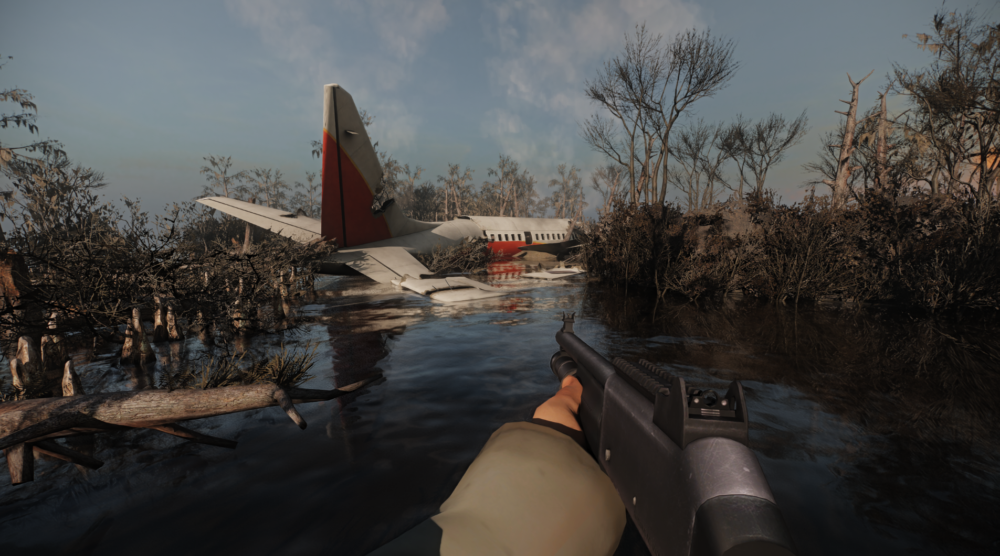
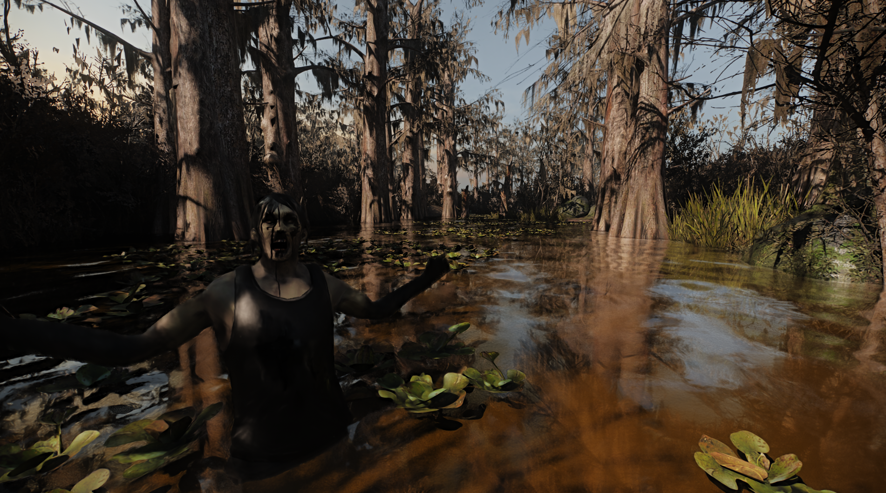
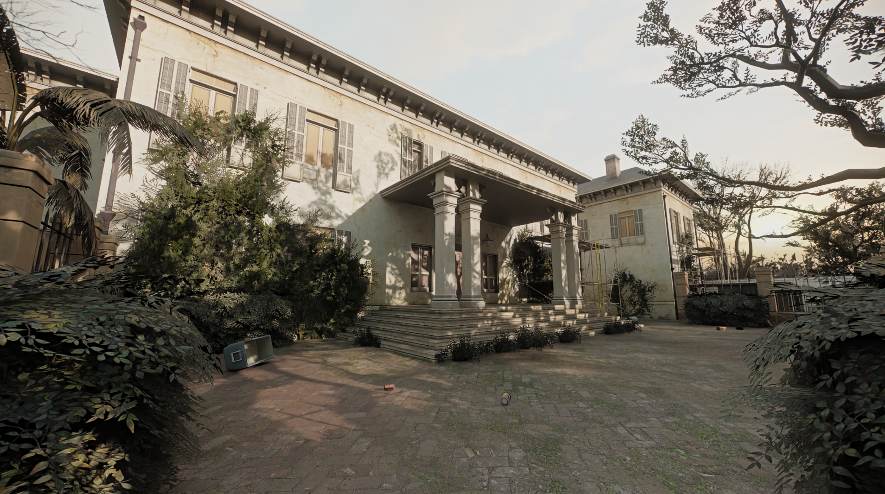
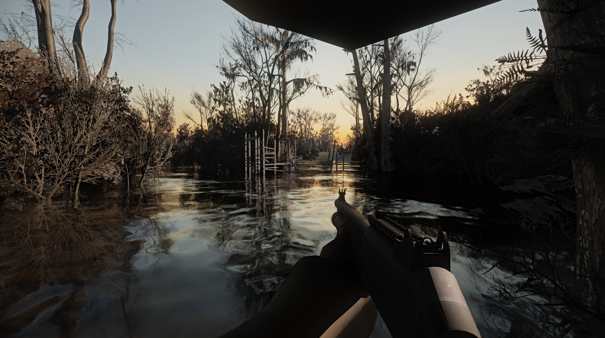

<h1 align="center">Left 4 Dead 2 - RTX Remix Compatibility Mod</h1>

 

This client modification is specifically made for nvidia's [rtx-remix](https://github.com/NVIDIAGameWorks/rtx-remix).  
How does a shader based game work with remix? By manually reimplementing fixed function rendering :) 

 

__WIP__ & __Please Note:__  
RTX Remix was never intented to support this game so expect stuff to be broken.  
__This is not trying to be a remaster__. It simply makes the game compatible with RTX Remix.

Please keep that in mind.

 

 

### __[ Remix Compatibility Features ]__   
🔹Most things are rendered using the fixed-function pipeline🔹  
🔹Remix friendly culling and the ability to manually override culling🔹  
🔹Ability to spawn and animate lights on events using a keyframe system🔹  
🔹Per map loading of remix config files to set remix variables🔹  
🔹Ability to animate remix variables on events🔹  
🔹Spawning of unique anchor meshes🔹  
🔹Per map fog settings and much more🔹  

 
 

If you want to support my work,  
consider buying me some coffee:  

 
 

## Usage / Installation
- Download the latest [release](https://github.com/xoxor4d/l4d2-rtx/releases) and follow instructions found __there__.
- Start the game by executing `run-l4d2-rtx.bat` (_start as admin if game is installed under `Program Files`_)
- The window title should change to Left 4 Dead 2 - RTX - followed by the GitHub commit number if successful

 

#### 🟨 Expectancy:
Let me get this straight again: __This is not a remaster__.  
The compatibility mod itself does not enhance any assets and only handles a few lights and as such, might even look worse than the original game. This will however change when community made mods with proper enhanced assets and proper lighting get available.   
There is a [base-remix-mod](https://github.com/xoxor4d/l4d2-rtx-base-mod) that I have created that remixes things on a few maps (eg. water, a few lights) but it's really limited.

You'll encounter some of the following:
- Ugly looking water surfaces
- Rubbery looking textures
- Missing sunlight
- Very dark areas
- Missing (black) skybox (you need to assign the __Sky__ category to skybox textures via remix in-game settings)

 

#### 🟥 Issues:
- The renderer is forced to run single threaded (currently required)
- Alpha tested foliage kills performance. This might improve with future updates to rtx-remix itself or when community mods with _proper_ assets are available
- Skinning of meshes (animated meshes) is done via software (on the CPU) resulting in CPU bottlenecks
- Some effects look incorrect because of the limitations of fixed-function, other issues or they are simply not yet handled correctly.

 

#### 🟦 Info: 
- See the [Wiki](https://github.com/xoxor4d/l4d2-rtx/wiki) for in-depth guides on features that come with the compatibility mod 🍓
- Current releases ship with a [custom build of the remix-dxvk runtime](https://github.com/xoxor4d/dxvk-remix/tree/combine/l4d2) which includes necessary changes for L4D2 (`bin/.trex/d3d9.dll`)

#### 🟩 Remixing:  
- Press __F5__ to open the in-game gui to tweak compatibility mod related settings or to edit [MapSettings](https://github.com/xoxor4d/l4d2-rtx/wiki/Map-Settings)
- A few things when it comes to remixing of certain objects [Wiki](https://github.com/xoxor4d/l4d2-rtx/wiki/Remixing-Notes)

 

##  Credits
- [Nvidia - RTX Remix](https://github.com/NVIDIAGameWorks/rtx-remix)
- [People of the showcase discord](https://discord.gg/j6sh7JD3v9) - especially the nvidia engineers ✌️
- [imgui-blur-effect](https://github.com/3r4y/imgui-blur-effect)
- [l4d2-internal-base](https://github.com/gh-0x/l4d2-internal-base/tree/master)
- [Dear ImGui](https://github.com/ocornut/imgui)
- [minhook](https://github.com/TsudaKageyu/minhook)
- [toml11](https://github.com/ToruNiina/toml11)

 

